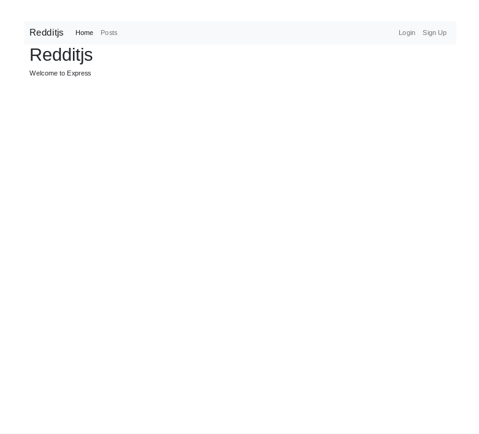
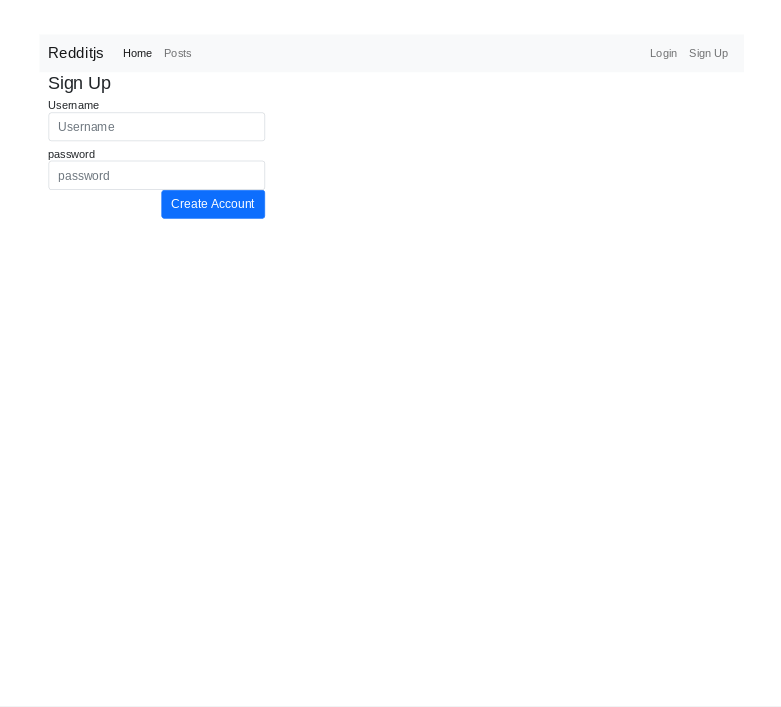
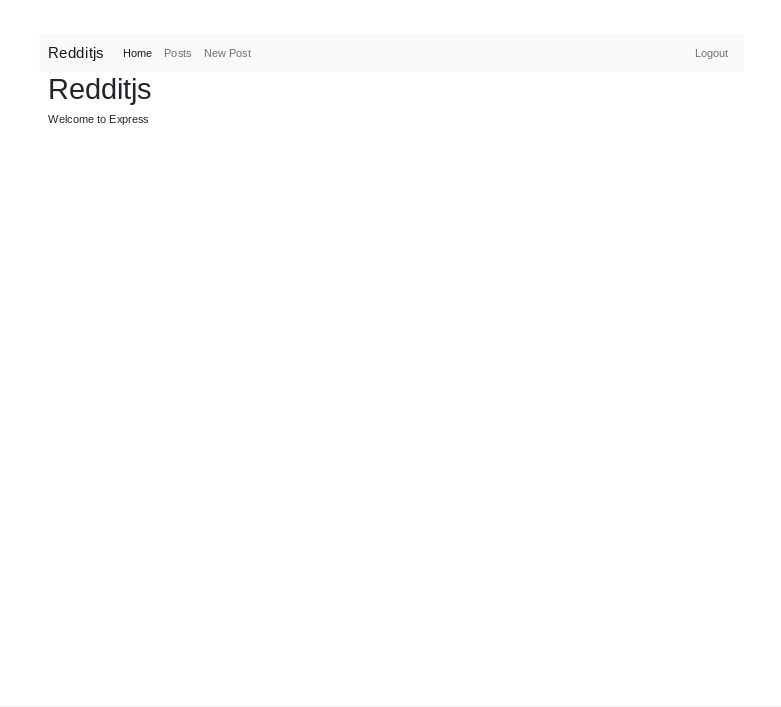
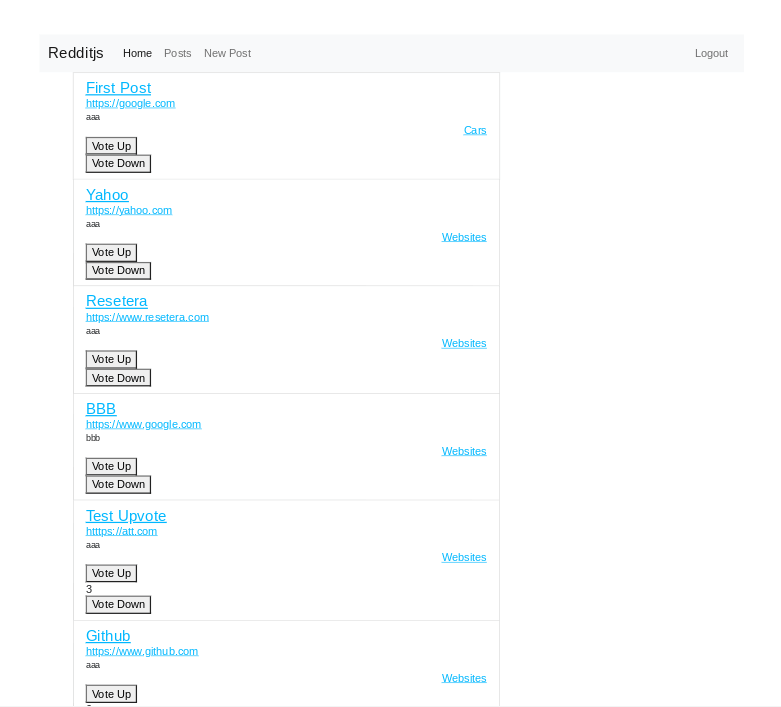
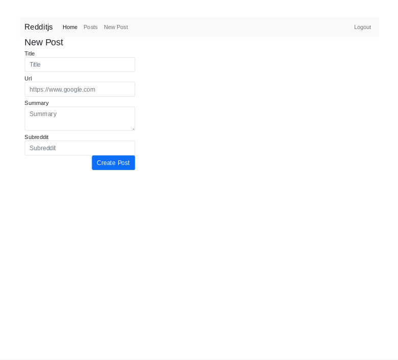
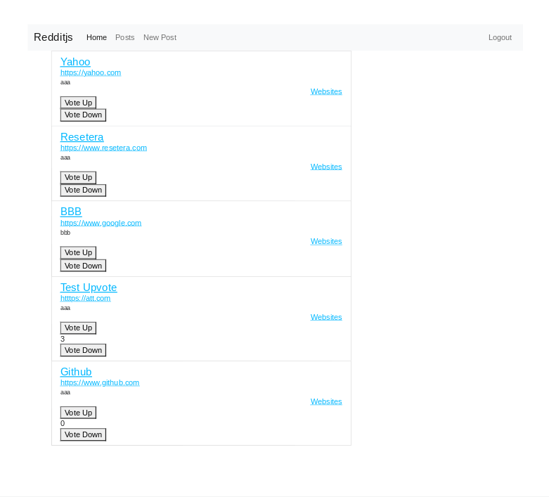
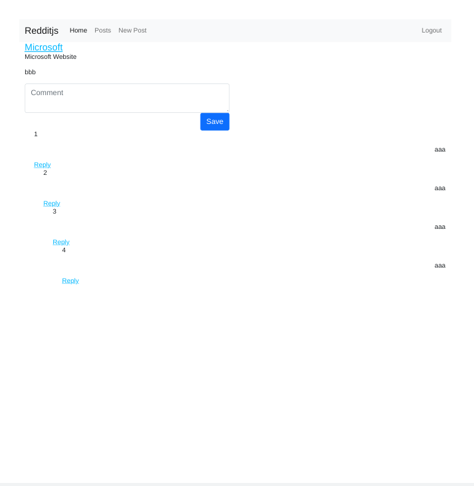

<h1 align="center">Redditjs</h1>

<div align="center">
   Based on tutorial from  <a href="https://makeschool.org/mediabook/oa/tutorials/reddit-clone-in-node-js/technical-planning/" target="_blank">makeschool.org</a>.
</div>

## Table of Contents

- [Overview](#overview)
  - [Built With](#built-with)
- [How to Use](#how-to-use)
- [Thoughts](#thoughts)
- [Continued Development](#continued-development)
- [Useful Resources](#useful-resources)

## Overview

MakeSchool was a coding bootcamp that went under.  Most content was made free and I found this and decided to follow along.















### Built With 

- bcryptjs
- cookie-parser
- express
- express-handlebars
- jsonwebtoken
- mongoose
- chai
- mocha

## How To Use

To clone and run this application, you'll need [Git](https://git-scm.com) and [Node.js](https://nodejs.org/en/download/) (which comes with [npm](http://npmjs.com)) installed on your computer. From your command line:

```bash
# Clone this repository
$ git clone https://github.com/jdegand/redditjs

# Install dependencies
$ npm install

# Add .env with MONGO_URI connection string and SECRET KEY

# Run the app
$ npm start
```

## Thoughts

- Worked on this November 2021, I got stuck on the nested replies and put it down and forgot about it til July 2022.  
- I deviated from the instructions at various points and that made this project harder to complete.  
- I didn't add a controllers file. 
- I used mergeParams to make the nested routes. 
- I didn't create a separate db file - I like to just add it to the app/index/server.js file. 
- The final result is sort of held together by duct tape but it matches the functionality of the tutorial's completed result.  
- Need to refresh to see the score change on the page index page although the score is updated automatically with the jquery.  
- Could try to use the jquery to update the player score in the page index page.  
- lean() is a critical fix for handlebars rendering issues. 
- Adding the pre's to the schemas fixed nested reply links from missing a postId property. 
- Populating in the routes didn't work as well.  
- Unsure if the order of lean and populate calls matters. ie model.lean().populate('') vs model.populate('').lean()
- Converting to async just requires using try and catch blocks. The tutorial makes it seem like a big deal.  
- The tutorial used bcryptjs but probably should have used regular bcrypt.
- Not Found - problem with navbar - didn't reflect logged in status - fixed by passing currentUser variable in error handler

## Continued Development

- Dependencies could be updated further but mocha has breaking changes
- Bootstrap styling for tablets & up and down buttons
- Redditjs and Home in the navbar are redundant.  Home Link could be eliminated.  
- Nested reply order - works fine when starting from stratch.  Older replies from development didn't display correctly.
- Add delete functionality. 
- Limit upvotes/downvotes to 1 per user - check array for user id before execution
- Can't get a console.log to register in the ajax script
- Middleware to pass currentUser to all routes
- Doesn't show cookies blocked until you try to login / signup

## Resources
- [Stack Overflow](https://stackoverflow.com/questions/21396524/what-is-the-difference-between-assert-expect-and-should-in-chai) - assert vs expect
- [Code For Geek](https://codeforgeek.com/unit-testing-nodejs-application-using-mocha/) - unit testing with mocha
- [Stack Overflow](https://stackoverflow.com/questions/25260818/rest-with-express-js-nested-router) - nested routes
- [Stack Overflow](https://stackoverflow.com/questions/24002342/node-js-express-nested-routes) - nested routes
- [Github](https://gist.github.com/zcaceres/f38b208a492e4dcd45f487638eff716c) - nested routes
- [YouTube](https://www.youtube.com/watch?v=_TI6iODy4yU) - Pursuit YT Express Video
- [Stack Overflow](https://stackoverflow.com/questions/35733647/mongoose-instance-save-not-working) - mongoose save not working
- [JQuery Docs](https://api.jquery.com/jquery.ajax/) - ajax method
- [FreeCodeCamp](https://www.freecodecamp.org/news/how-to-update-npm-dependencies/) - updating npm dependencies